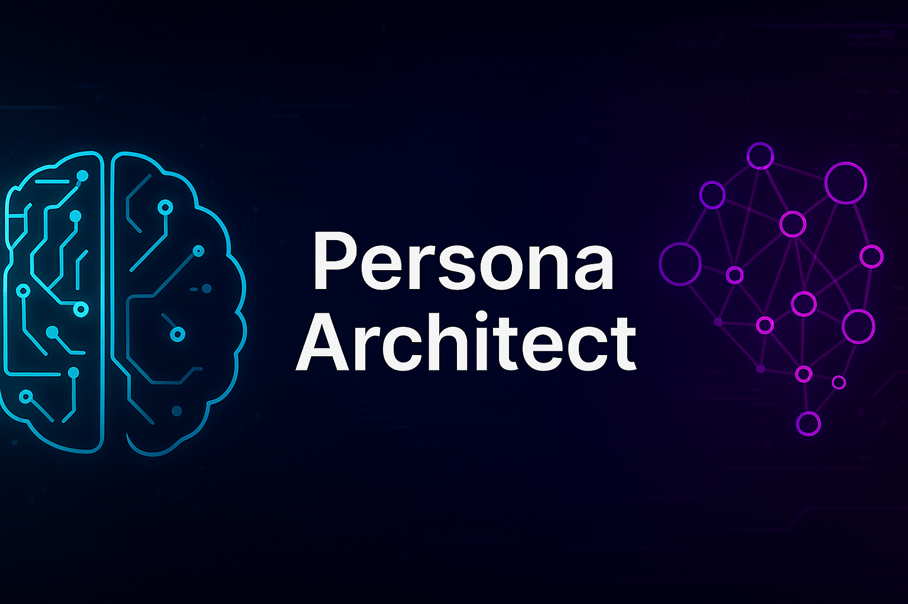

<p align="center">
  
</p>

# Persona Architect

🧠 Simulate intelligent AI personas with modular, prompt-based architecture using Python + NLP.

---

## 🔍 Features

Persona Architect allows you to:

- Define AI personalities in a JSON config
- Load and switch between personas during runtime
- Simulate responses using OpenAI (or offline stub logic)
- Track and save full conversations with session history
- Use for coaching, writing, training, or prototyping AI agents
- Minimal CLI interface with modular file structure

---

## 📂 Project Structure

- `main.py` – CLI runner and command interface  
- `persona_config.json` – Persona definitions  
- `prompt_builder.py` – Prompt construction logic  
- `memory.py` – Tracks user + AI dialogue history  
- `response_handler.py` – Handles AI or mock responses  
- `session_saver.py` – Saves session logs to timestamped file  
- `templates/` – Prompt templates used per persona  

---

## 🛠 Requirements

Only needed for live OpenAI mode:

```bash
pip install openai

---

▶️ Offline Mode (Stub)

Runs without internet or API key using a placeholder AI response for testing purposes only:

python main.py

This mode is useful for previewing the CLI interface and basic functionality — but all personas will reply with the same default message.

> ⚠️ To fully experience dynamic, intelligent persona simulation, OpenAI mode is required.

---

🌐 OpenAI Mode (Recommended)

Enables full AI response capability using your OpenAI API key. Required for realistic, persona-driven interaction.


1. Create a config.py file in the root directory:

OPENAI_API_KEY = "your-openai-api-key-here"

2. In response_handler.py, set:

USE_OPENAI = True

3. Run the application:

python main.py

⚠️ Important: Never upload or share your API key publicly.

---

💾 Command List

Interact with the AI using natural language or CLI commands:

Command	Description

/save	Saves the current session with timestamp
/switch <name>	Switch to another persona (saves current first)
/name <new_name>	Rename the current persona
/list	List all available personas
/delete	Deletes the current persona session
/exit or /quit	Ends the session and saves conversation


---

📄 License

MIT – Free to use and extend.


---
